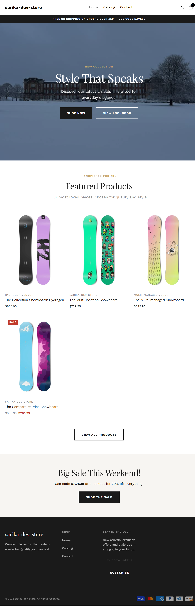
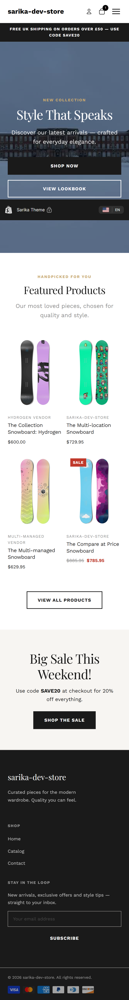
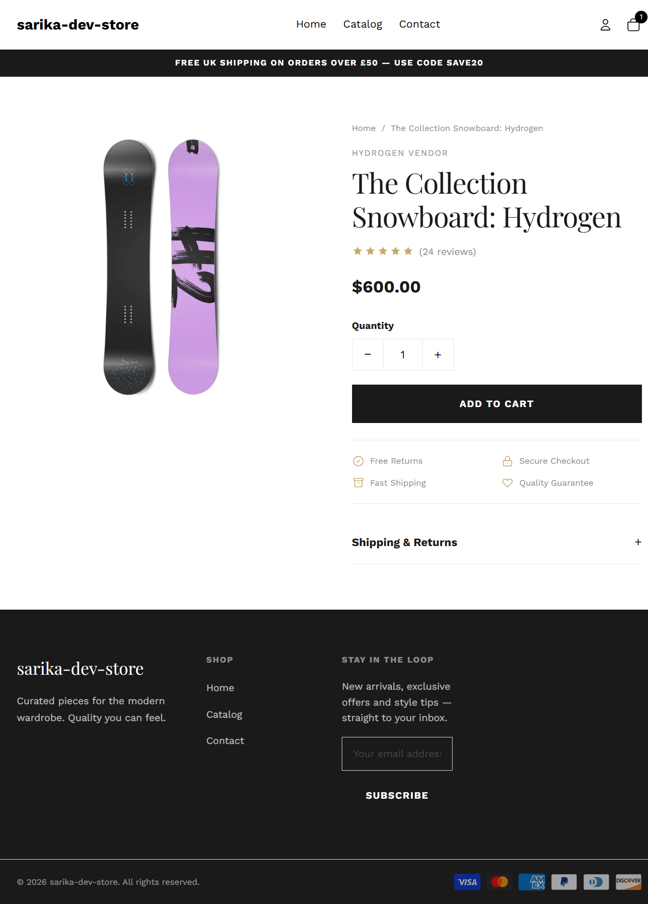
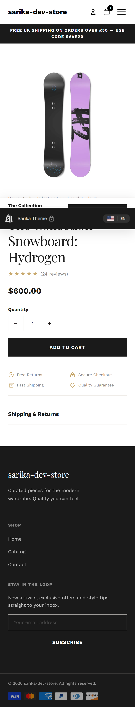
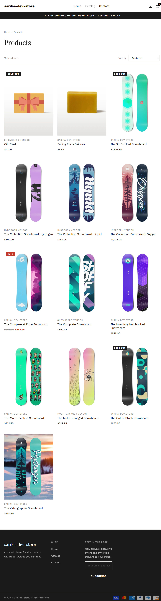
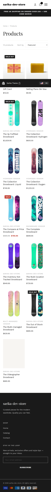
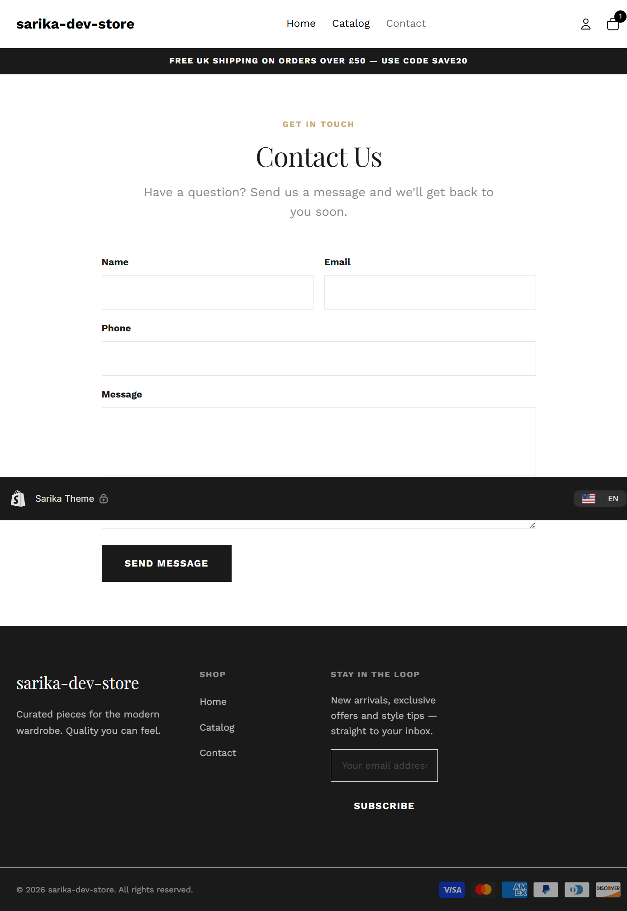
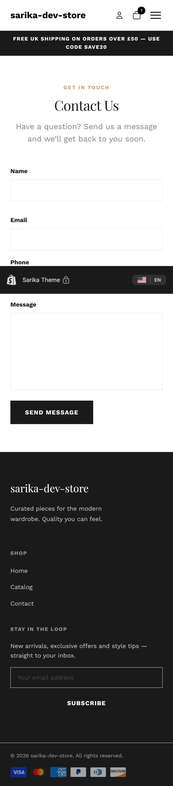

# Sarika Theme — Custom Shopify E-commerce Theme

**Role:** UI/UX Design & Front-End Development
**Platform:** Shopify (Liquid, HTML, CSS, JavaScript)
**Type:** Custom theme built from scratch

---

## Overview

A custom Shopify theme built to demonstrate conversion-focused e-commerce
design and clean front-end delivery. The project covers the full customer
journey — from landing page through product discovery, product detail, and
enquiry — with a consistent visual identity and a fully responsive layout
across desktop, tablet, and mobile.

**Live preview:** https://sarika-dev-store.myshopify.com

---

## The Problem

The starting point was a bare skeleton theme:

- No visual identity — default fonts, no colour system, no spacing consistency.
- A near-empty homepage (a single placeholder section).
- Generic, unstyled product and collection pages with weak visual hierarchy.
- No conversion-focused features (no clear calls to action, trust signals, or
  streamlined add-to-cart flow).
- Inconsistent layout widths between the header and page content.

The goal was to turn this into a polished, professional storefront that
balances aesthetics, usability, and commercial performance.

---

## The Approach

### 1. Design system first
Established a reusable set of design tokens (CSS custom properties) for colour,
typography scale, spacing, radius, and shadows — all editable by a merchant
through the theme editor. This keeps the UI consistent and easy to maintain,
and demonstrates a systematic rather than ad-hoc approach to styling.

### 2. Conversion-focused homepage
- Full-width hero with a clear headline, supporting copy, and dual calls to
  action (primary + secondary).
- Announcement bar for promotions (free shipping / discount code).
- Featured products grid with a "view all" path into the catalogue.
- Promotional banner to highlight active offers.

### 3. High-intent product page
Designed around removing friction from the path to purchase:
- Image gallery with thumbnail switching.
- Prominent price with sale/compare-at handling.
- Variant selector and quantity stepper.
- Trust badges (free returns, secure checkout, fast shipping, quality
  guarantee) to reduce purchase anxiety.
- Sticky add-to-cart bar on mobile so the CTA is always reachable.
- Expandable accordions for description and shipping details to keep the page
  scannable.

### 4. Usable collection browsing
- Clear breadcrumb and product count.
- Sort control wired to Shopify's native URL parameters.
- Responsive product grid with hover-reveal quick-add.
- Styled pagination.

### 5. Enquiry and support
- Custom contact form using Shopify's native form handling, with required
  fields and success/error states.

### 6. Responsive and consistent
- Mobile-first layouts with defined breakpoints.
- Resolved a layout-width inconsistency so the header, hero, and content all
  align to the same container system.

---

## The Result

- A complete, coherent storefront covering the full customer journey.
- A maintainable, token-driven design system that a non-technical merchant can
  customise through the theme editor.
- Conversion-focused patterns applied throughout (clear CTAs, trust signals,
  frictionless add-to-cart, always-reachable mobile CTA).
- Fully responsive across desktop, tablet, and mobile.

---

## Key Skills Demonstrated

- UI/UX design for e-commerce (layout, hierarchy, customer journey)
- Conversion-focused design decisions
- Responsive, mobile-first front-end development
- HTML, CSS (design tokens / custom properties), JavaScript
- Shopify theme development (Liquid, sections, snippets, templates)
- Building merchant-configurable, maintainable components

---

## Screenshots

### Homepage
| Desktop | Mobile |
|---------|--------|
|  |  |

### Product Page
| Desktop | Mobile |
|---------|--------|
|  |  |

### Collection Page
| Desktop | Mobile |
|---------|--------|
|  |  |

### Contact Page
| Desktop | Mobile |
|---------|--------|
|  |  |
